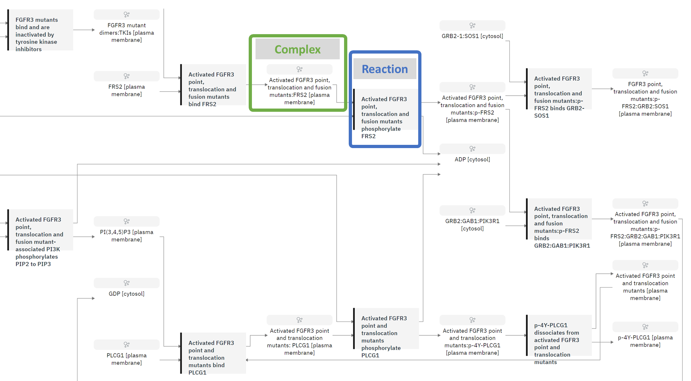
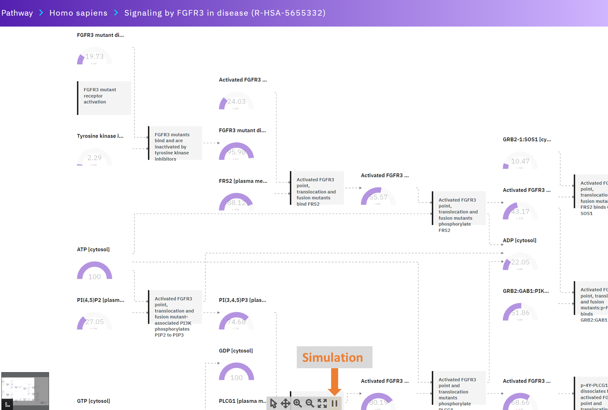
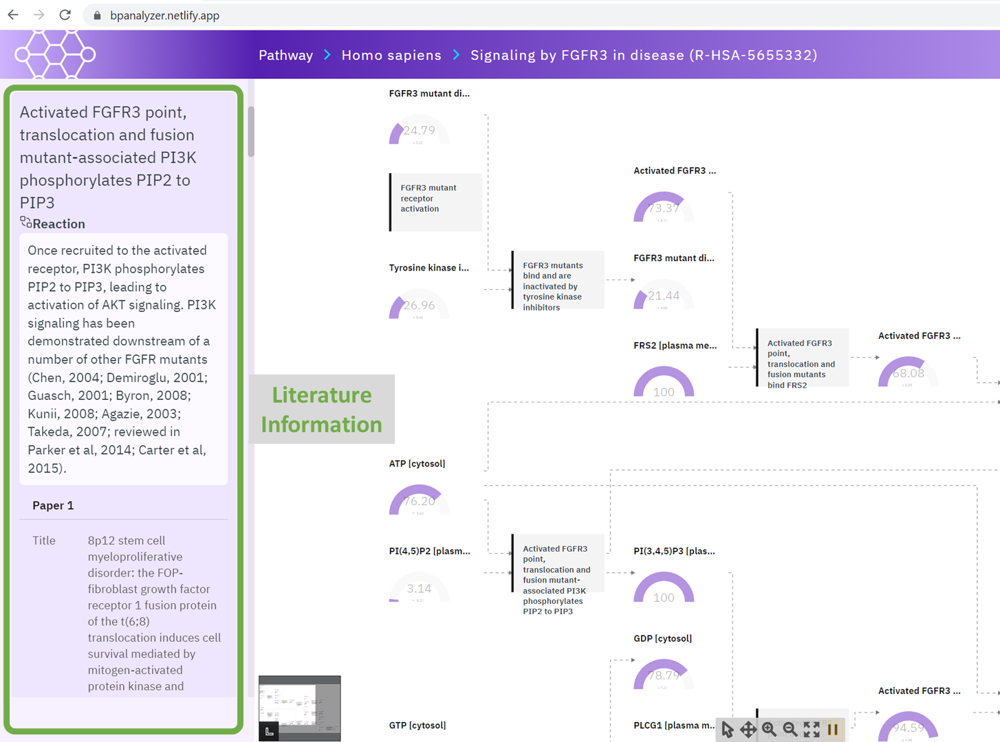

# A Project of Biological Pathway Analyzer

- A biological pathway analyzer is a web-based tool that is used to study and understand the complex biological pathways that occur within living organisms. 

- The pathways are composed of a series of biochemical reactions that are responsible for various biological functions such as metabolism, cell signaling, and gene expression.

- Our goal of the biological pathway analyzer is to create, simulate, and visualize these pathways in order to gain insights into how they function and how they are regulated. 

- This can help researchers better understand the underlying mechanisms of diseases and develop new treatments.

# Current Features of the Biological Pathway Analyzer (BPA) 

## 1. Basic User Interface.

- BPA contains a pathway view, detailed information view, and pathway view.

## 2. Pathway Information  

- The pathway view shows complexes, reactions, etc from Reactome Data.

## 3. Pathway Simulation

- In the pathway view, a pathway simulation can be performed by clicking the simulation button below.
- The current version of the simulation is just a random number generation.
- In the future, a specific rule for the simulation can be embedded by extracting such a rule from literature.

## 4. Literature Information
- The detailed information view shows the node and literature information.

## Demo link
The web link is below.

https://bpanalyzer.netlify.app/

